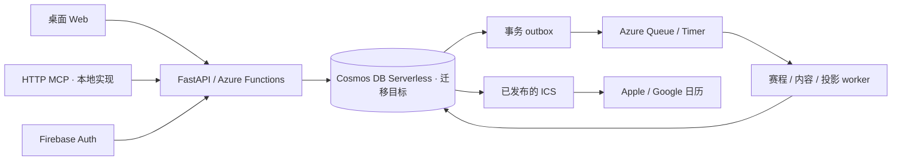

# Anke Sports · 当前架构决策

更新于2026-09-13。用户最新决策优先于原 v1 文档中的建议技术栈。

| 边界 | 决策 | 状态 |
| --- | --- | --- |
| 产品 | Anke Sports；桌面 Web、外部 MCP；不做Chrome扩展 | 已确认 |
| UI | Apple Sports 的克制色彩、紧凑卡片和文字层级；桌面月/周/日程及事件抽屉 | Web 本地实现 |
| 身份 | Firebase Auth 客户端 ID Token，Admin 验证签名、发行方、有效期与撤销 | 独立开发项目真实Google登录、验签与偏好读写通过；云部署待验 |
| 权威业务 | Python/FastAPI，HTTP/Queue/MCP 共用服务层 | SQL基线HTTP/任务/MCP本地实现，实际Codex调用已有证据；文档模式MCP未接入 |
| 数据 | Azure Cosmos DB for NoSQL Serverless，Periodic 备份 | 用户已确认；现有 SQL/SQLite/MySQL 代码作为迁移基线，Cosmos 实现与验收进行中 |
| 后台任务 | 业务变更与 outbox 同分区事务；Azure Storage Queue/timer，重试/租约 | SQL与文档事务/投递已有本地证据，真实Cosmos与云触发器待验 |
| 日历交付 | 发布时计算投影、保存 ICS；读取只返回稳定内容与条件请求响应 | 本地验证 |

## 关键规则

- 公共赛事 ID、个人投影 ID 与 Feed 访问令牌分别保存。改期或补充内容不改变 UID；内容不变不增加 SEQUENCE、DTSTAMP、ETag。
- 当前 F1 输入使用 season + circuitId + session 作为来源键；不使用可重排的轮次和开始时间。若同季多站共用同一 circuitId，停止该批更新并要求显式消歧，避免合并。
- 原始第三方响应成功且全部分页完整后才更新；任何异常回滚整批，不按缺失结果清空赛程。
- 历史投影保留近 90 天；默认发布未来 180 天。取消关注后的近期历史记录继续接收内容；明确排除比赛生成取消投影。
- 私人链接和公共来源分离，用户 block 覆盖自动发现。自动发现、匹配与待确认已通过隔离本地测试；手工添加不获得官方认证。
- 公共接口返回已接入来源，未承诺全运动、全赛季覆盖。时间以赛事官方发布为准。
- 列表已有游标分页、批量读取与本机20k赛事压测；容量范围见 schedule-queries.md 与 content-capacity.md，不能据此宣布云容量验收通过。

## 交付顺序

当前按[实施计划](<../../anke-sports 文档/Anke_Sports_实施计划.md>)收敛真实主流程；下列M0–M6保留全范围，不要求早期先完成全部模块、GC或规模工作。

M0：ICS 真日历变更、内容直达矩阵、三类 Provider、YouTube 推送 PoC。外部实验未通过前，不承诺手机自动更新时间或具体 App 唤起。

M1：先让本地 Web → 关注 → 持久任务 → 个人 ICS 可操作，并补真实 Firebase 和 staging 验证。该路径已在本机实现，后续模块也已推进；实现结果不替代 M0 设备证据。

M2：YouTube 通知/续订/补查、作者范围、明确匹配/待确认/人工纠错；补齐 NBA、足球、F1 适配器边界与覆盖证据。

M3：明确审核来源的本场直播入口、地区/观看条件、链接失效维护。

M4：公网MCP，统一账号、配置、权限与接口。MCP 认证与敏感写操作需按目标客户端实际能力验收。既有Chrome 380×560实现只作历史证据。

M5：恢复演练、完整 QA、支持范围、许可与开源发布。M6：Google OAuth 独立辅助日历增强同步。

不承诺固定周数。原始 T01–T35 与 QA-01–QA-32 编号保留，逐项附证据再改完成状态。

## 云环境准备

用户授权使用托管Chrome创建配置独立云资源，并再次确认后端使用Azure Functions。Firebase开发项目anke-sports-dev已创建，真实Google登录通过。Azure账号已登录；独立资源组/Functions/Cosmos Serverless + Periodic/Storage以及Web/API HTTPS目标尚待配置。已知资源与验收边界见 cloud-development.md。部署前明确目标和费用边界，验证 Cosmos 周期备份恢复与迁移回滚；无需改动现有 FormaLM。

Firebase projectId 与加密 key 在非 local 模式强制要求，数据库连接验证 TLS。Feed 私密路径还需要验证 Azure 平台请求遥测与反向代理日志脱敏；目前仅关闭本机访问日志和降低 Functions 主机日志级别，尚不能声明云端秘密不落日志的验收通过。

SQL基线的公共球队/赛事日历已使用独立 PublicFeed 和共用投影逻辑发布，匿名读取不创建账号或任务。生产分发按具体来源启用，详见 [公共日历](public-feeds.md)。

用户已选择 Cosmos Serverless + Periodic。目标模板和分区事务/发布迁移合同见 [Cosmos 存储设计](cosmos-storage-design.md)；当前部署模式中的 SQL 校验仍属于原实现，尚未完成全部业务模块的 Cosmos 运行时接入，不应将新模板与旧源码包混用。
